<!-- omit in toc -->

# BPM Projekt Referenz-Implementierung

Dieses Repo soll als Blaupause für BPM Projekte dienen. Dabei soll es möglich sein unterschiedliche Technologien wie
Camunda, React, Vue etc. nach und nach zu ergänzen.

Die Dokumentation des Projekts erfolgt nach [arc42](https://arc42.org/).

<!-- omit in toc -->

## Architekturdokumentation

**Über arc42**

arc42, das Template zur Dokumentation von Software- und
Systemarchitekturen.

Template Version 8.2 DE. (basiert auf AsciiDoc Version), Januar 2023

Created, maintained and © by Dr. Peter Hruschka, Dr. Gernot Starke and
contributors. Siehe <https://arc42.org>.

- [Einführung und Ziele](#einführung-und-ziele)
    - [Qualitätsziele](#qualitätsziele)
    - [Stakeholder](#stakeholder)
- [Randbedingungen](#randbedingungen)
    - [Technisch](#technisch)
        - [Verwaltung von Dependencies](#verwaltung-von-dependencies)
        - [Fremdsoftware frei verfügbar](#fremdsoftware-frei-verfügbar)
- [Kontextabgrenzung](#kontextabgrenzung)
    - [Fachlicher Kontext](#fachlicher-kontext)
    - [Technischer Kontext](#technischer-kontext)
- [Lösungsstrategie](#lösungsstrategie)
  - [Backend](#backend)
    - [Clean Architecture](#clean-architecture)
      - [Bausteinsicht](#bausteinsicht)
      - [Laufzeitsicht](#laufzeitsicht)
    - [Dependency Inversion Principle](#dependency-inversion-principle)
    - [Mapping zwischen Schichten](#mapping-zwischen-schichten)
    - [Domain Driven Design](#domain-driven-design)
- [Bausteinsicht](#bausteinsicht-1)
    - [Whitebox Gesamtsystem](#whitebox-gesamtsystem)
        - [Eben 1: Aufgabenliste](#eben-1-aufgabenliste)
- [Laufzeitsicht](#laufzeitsicht)
- [Verteilungssicht](#verteilungssicht)
- [Querschnittliche Konzepte](#querschnittliche-konzepte)
- [Architekturentscheidungen](#architekturentscheidungen)
- [Qualitätsanforderungen](#qualitätsanforderungen)
    - [Qualitätsbaum](#qualitätsbaum)
    - [Qualitätsszenarien](#qualitätsszenarien)
- [Risiken und technische Schulden](#risiken-und-technische-schulden)
- [Glossar](#glossar)

## Einführung und Ziele

### Qualitätsziele

Blaupause und Nachschlagewerk für gewisse Fragestellung die in BPM Projekte häufiger auftreten. Zudem soll es dem
Onboarding neuer Mitarbeiter dienen.

### Stakeholder

| Rolle        | Kontakt        | Erwartungshaltung |
|--------------|----------------|-------------------|
| *\<Rolle-1>* | *\<Kontakt-1>* | *\<Erwartung-1>*  |
| *\<Rolle-2>* | *\<Kontakt-2>* | *\<Erwartung-2>*  |

## Randbedingungen

### Technisch

#### Verwaltung von Dependencies

Zur Verwaltung von Dependencies soll

- in der Backend-Java-Welt [Maven](https://maven.apache.org/) und
- in der Frontend-Welt [npm](https://www.npmjs.com/)

eingesetzt werden.

#### Spezifische technische Randbedingungen

[Spring Boot](https://spring.io/projects/spring-boot): Als Application Framework
[Spring Data JDBC](https://spring.io/projects/spring-data-jdbc) + [Liquibase](https://www.liquibase.com/): Für
Datenbankanbindung und Schema-Migration
[domain-primitives-java](https://github.com/domain-primitives/domain-primitives-java): Für Validierung der
Domain-Objekte
[MapStruct](https://mapstruct.org/): Für Mapping zwischen Domain-Objekten und Resources

#### Fremdsoftware frei verfügbar

Falls zur Lösung Fremdsoftware hinzugezogen wird, sollte diese idealerweise frei verfügbar und kostenlos sein. Die
Schwelle der Verwendung wird auf diese Weise niedrig gehalten

## Kontextabgrenzung

### Fachlicher Kontext

**\<Diagramm und/oder Tabelle>**

**\<optional: Erläuterung der externen fachlichen Schnittstellen>**

### Technischer Kontext

**\<Diagramm oder Tabelle>**

**\<optional: Erläuterung der externen technischen Schnittstellen>**

**\<Mapping fachliche auf technische Schnittstellen>**

## Lösungsstrategie

### Backend

#### Clean Architecture

Eine Softwarearchitektur, die Veränderbarkeit in ihre Paket- und Klassenstruktur integriert, erleichtert den Wechsel oder die Migration eines Frameworks. Daher ist die bspw. Migration von Camunda Platform 7 auf 8 dank einer guten Architektur wesentlich weniger aufwendig.

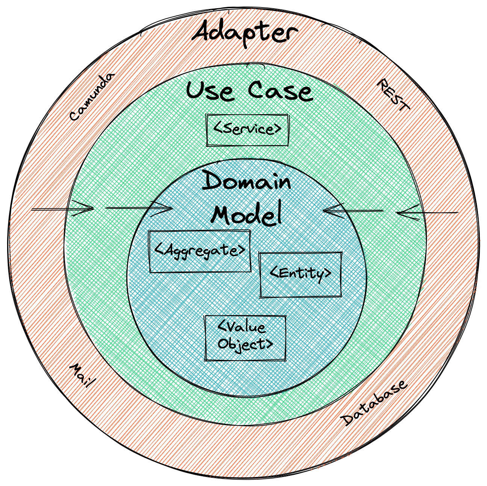
*Die Ringe der Clean Architecture (basierend auf Clean Architecture by Robert C. Martin)*

Robert C. Martin beschreibt in seinem Buch [Clean Architecture](https://blog.cleancoder.com/uncle-bob/2012/08/13/the-clean-architecture.html) architektonische Richtlinien, die die Unabhängigkeit von Frameworks, Datenbanken, Benutzeroberflächen (UI) und anderen Technologien gewährleisten sollen. Seiner Meinung nach gewährleistet eine saubere Architektur durch ihr Design die Testbarkeit von Geschäftsregeln.

Die Grafik oben zeigt Schichten als konzentrische Ringe, die sich gegenseitig umschließen. Jede Schicht repräsentiert verschiedene Teile der Software. Der Mittelpunkt der Ringe steht die Geschäftsregeln und Ihr Domänenwissen. Die äußeren Ringe sind „Mechanismen”, die unser Domänenzentrum unterstützen. Neben den Schichten zeigen die Pfeile die Abhängigkeitsregel - nur nach innen gerichtete Abhängigkeiten (siehe [Dependency Inversion Principle](#dependency-inversion-principle))!

Um die Ziele einer sauberen Architektur zu erreichen, darf der Domänencode keine nach außen gerichteten Abhängigkeiten aufweisen. Stattdessen zeigen alle Abhängigkeiten auf den Domänencode. Der wesentliche Aspekt Ihrer Geschäftsdomäne befindet sich im Kern der Architektur: die Entitäten. Auf diese wird nur von der umgebenden Schicht zugegriffen: den Anwendungsfällen. Services in einer klassischen Schichtenarchitektur entsprechen Anwendungsfällen in einer sauberen Architektur, aber diese Services sollten feiner gegliedert sein, sodass sie nur eine einzige Aufgabe haben. Es sollte nicht, ein einziger großer Service alle Ihre Geschäftsanwendungsfälle implementiert. Unterstützende Komponenten wie Persistenz oder Benutzeroberflächen sind um den Kern (Ihre Entitäten und Anwendungsfälle) herum angeordnet.

##### Bausteinsicht

Die [Bausteinansicht](https://docs.arc42.org/section-5/)“ unten zeigt eine stereotype statische Zerlegung eines Systems unter Verwendung der Clean Architecture in Bausteine sowie deren Abhängigkeiten.

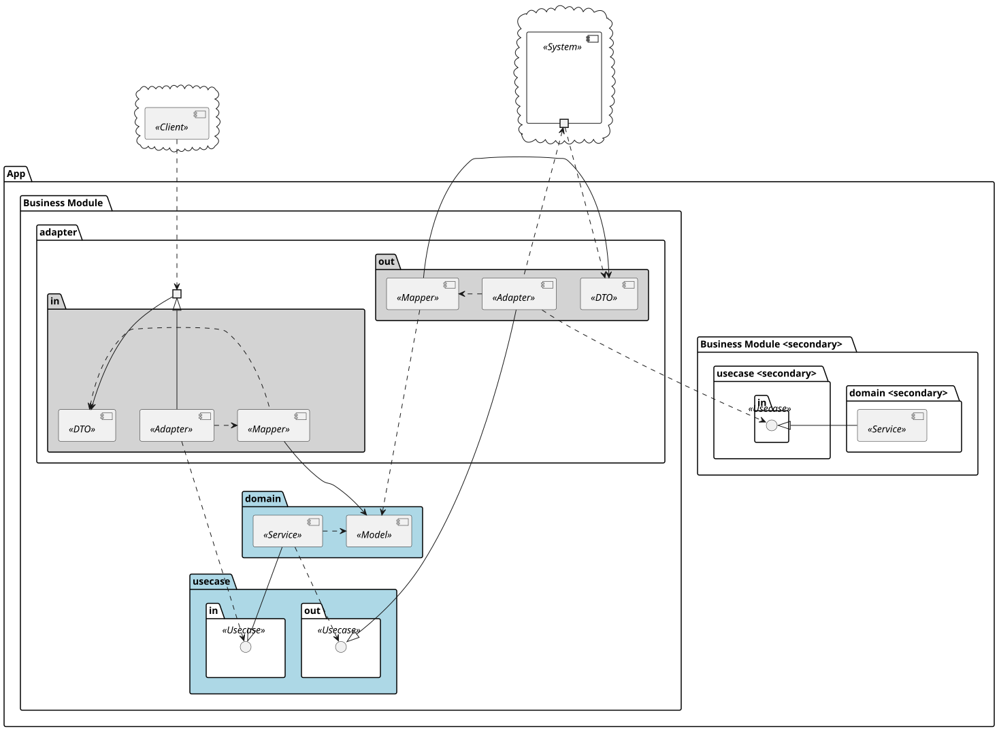
*Building Block View of Clean Architecture*

##### Laufzeitsicht

Die [Laufzeitansicht](https://docs.arc42.org/section-6/) unten beschreibt das konkrete Verhalten und die Interaktionen der stereotypen Bausteine eines Systems, das Clean Architecture verwendet.

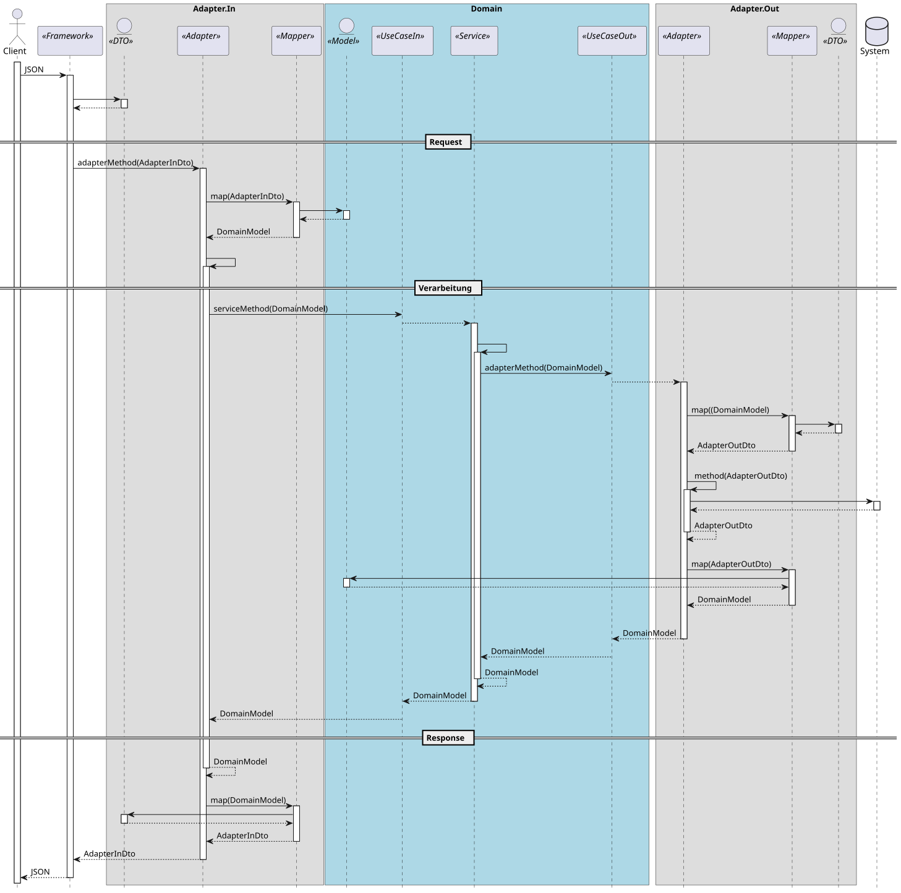
*Building Block View of Clean Architecture*

#### Dependency Inversion Principle

Durch Anwendung der Abhängigkeitsregel erhält die Domäne keine Kenntnis darüber, wie Sie Ihre Daten speichern oder wie Sie sie in einem Client anzeigen.
Die Domäne sollte keinen Framework-Code enthalten (außer evt. Dependency Injection). Wie bereits erwähnt, können Sie das Dependency Inversion Principle (DIP) verwenden, um die Abhängigkeitsregel der [Clean Architecture](#clean-architecture) anzuwenden.

Das DIP besagt, dass Sie die Richtung einer Abhängigkeit umkehren sollen. Vielleicht denken Sie an das Entwurfsmuster Inversion of Control (IoC), das nicht mit DIP identisch ist, obwohl beide gut zusammenpassen. Für die genauen Unterschiede empfehle ich Ihnen den Artikel von Martin Fowler [DIP in the Wild](https://martinfowler.com/articles/dipInTheWild.html#YouMeanDependencyInversionRight) (kurz gesagt: „[...] Bei IoC geht es um die Richtung, bei DIP um die Form.“). Die folgende Abbildung zeigt ein Beispiel dafür, wie das DIP funktioniert.

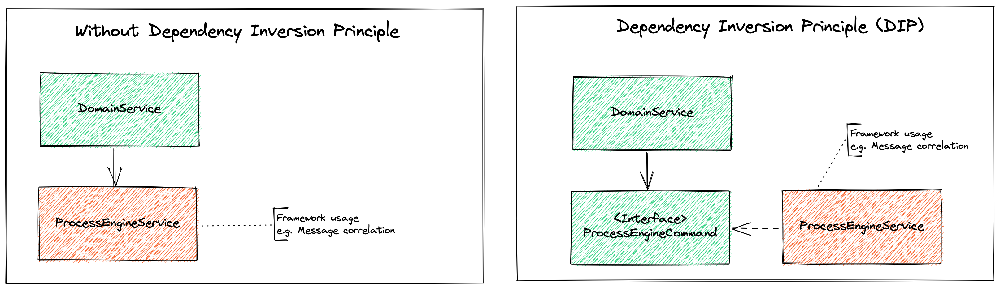
*Das Dependency Inversion Principle (DIP)*

Stellen Sie sich einen Service (DomainService in der Abbildung) vor, der einen Camunda-Prozess startet. Um Ihren Service (Ihre Geschäftslogik) vom Framework zu isolieren, könnten Sie einen weiteren Service mit der Camunda Java API erstellen, um eine Prozessinstanz zu starten. Der linke Rahmen der Abbildung zeigt dieses Szenario ohne Anwendung des DIP. Der Domain-Service ruft den ProcessEngineService direkt auf. Wo liegt also das Problem? Das Starten eines Prozesses ist ein zentraler Aspekt von

Durch die Kombination des DIP mit der [Ports und Adapter](http://alistair.cockburn.us/Hexagonal+architecture) Architektur (aus der die saubere Architektur hervorgegangen ist) erhalten wir die unten gezeigte Grafik.

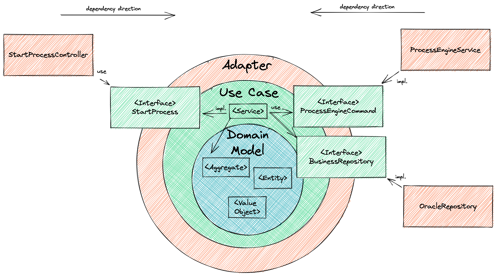
*Saubere Architektur DIP und Ports und Adapter*

Die Trennung unserer Ports/Anwendungsfälle und Adapter, die unsere Anwendung steuern (Eingangsports, Driving) oder von unserer Anwendung gesteuert werden (Ausgangsports, driven), hilft uns, unseren Code noch besser zu strukturieren und die Grenzen klarer zu halten.

#### Mapping zwischen Schichten

Die nachfolge Grafik zeigt, wie die Schichten mit dem Domänenobjekt mit und ohne Zuordnung interagieren. Ohne Zuordnung geht einer der größten Vorteil der [Clean Architecture](#clean-architecture) verloren: die Entkopplung Ihres Domänenkerns von den äußeren (Infrastruktur-)Schichten. Wenn man keine Zuordnung zwischen den inneren und äußeren Schichten vornimmt, sind diese nicht isoliert. Wenn ein System eines Drittanbieters sein Datenmodell ändert, muss man auch sein Domänenmodell ändern.

Um Abhängigkeiten von externen Einflussfaktoren zu vermeiden und Unabhängigkeit und Entkopplung zu fördern, ist es notwendig, zwischen den Schichten zu mappen.  Die Eingabe- und Ausgabeports (Use-Case-Schicht) dienen als Gatekeeper zu Ihrem Domänenkern und definieren, wie mit Ihrer Anwendung kommuniziert und interagiert wird.  Sie bieten eine klare API, und durch das Mapping in Ihre Domäne halten Sie diese unabhängig von Änderungen am Framework oder Technologiemodell.

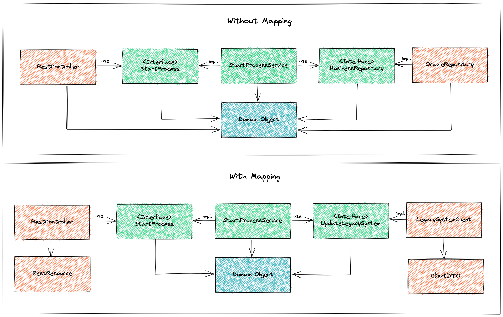
*Mit und ohne Zuordnung zwischen den Schichten*

Der Rahmen, der den Mapping-Ansatz erklärt, ist nur eine von vielen Möglichkeiten, Mapping durchzuführen. Um mehr über die verschiedenen Varianten des Mappings erfahren, empfehlt ich Tom Hombergs Buch [Get Your Hands Dirty on Clean Architecture](https://leanpub.com/get-your-hands-dirty-on-clean-architecture), in dem er diese sehr gut erklärt.

Zusammenfassend lässt sich sagen, dass Mapping verwendet werden kann, um eine stärkere Entkopplung zu erreichen. Andererseits kann das Mapping zwischen den einzelnen Schichten zu einer Menge Boilerplate-Code führen, was je nach Anwendungsfall und den Zielen, die Sie verfolgen, übertrieben sein könnte.

#### Domain Driven Design

Die Verwendung einer [Clean Architecture](#clean-architecture) als Architekturstil lässt sich perfekt mit Domain-driven Design kombinieren, da wir uns vollständig auf unseren Domänenkern (Entitäten und Anwendungsfälle) konzentrieren. Die Konzentration auf die Domäne wird durch das Ziel von [Clean Architecture](#clean-architecture) unterstützt, die Domäne frei von Frameworks oder Technologien zu halten. Beispielsweise konzentriert sich Ihre Domäne nicht darauf, wie etwas gespeichert wird, sondern weist lediglich den ausgehenden Port an, es zu speichern.  Die Implementierung des Ports (auf der Adapter-Ebene) entscheidet, ob beispielsweise relationale oder nicht-relationale Datenbanken verwendet werden.

Neben dem übereinstimmenden Ziel von DDD und [Clean Architecture](#clean-architecture) versucht DDD dabei zu helfen, komplexe Designs rund um Ihre Domäne zu erstellen, indem man beispielsweise unveränderliche Objekte erstellt, die alles über ihre Invarianten wissen, was noch mehr dabei hilft, den Code zu strukturieren.

DDD-Elemente wie Aggregate Entities und ValueObject werden aus der Bibliothek [domain-primitives](https://github.com/domain-primitives/domain-primitives-java) genutzt.

Die funktionale Strukturierung des Codes und die Einbringung von mehr Kontext in die Objekt, z. B. mit Value Object, hilft nicht nur, den Code ausdrucksstark zu halten, sondern auch, ihn nah an den Geschäft zu halten, wie auch das BPMN-Modell.

## Bausteinsicht

### Whitebox Gesamtsystem


#### Ebene 1: Aufgabenliste

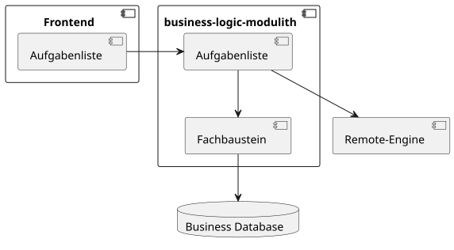

#### Ebene 2: Fachbausteine

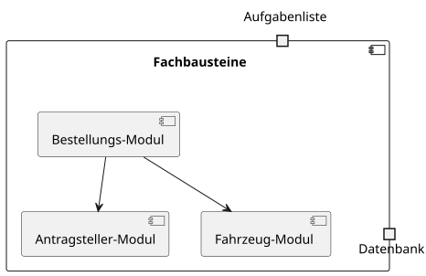

##### Bestellung

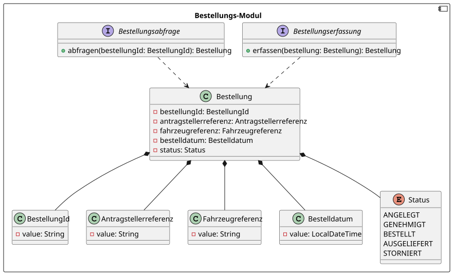

## Laufzeitsicht

### Bestellung erfassen

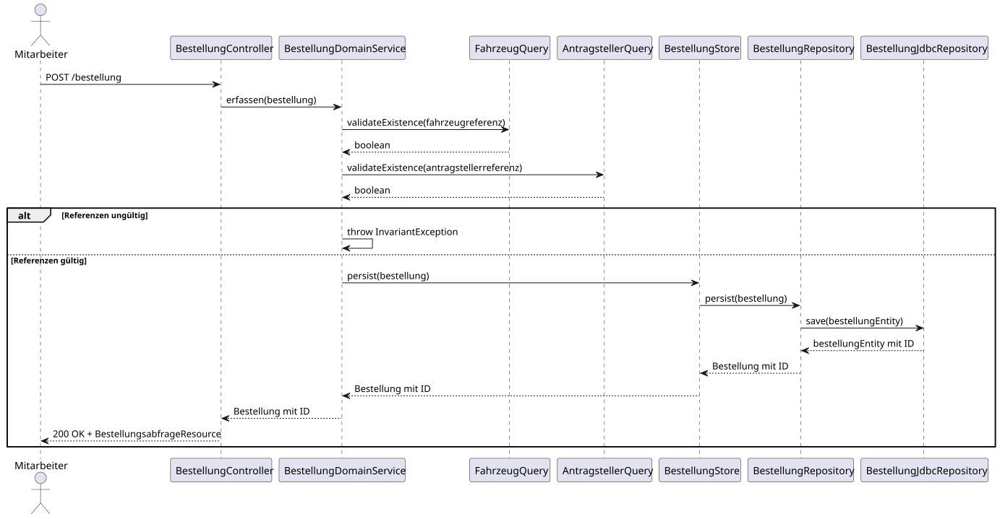

### Bestellung abfragen

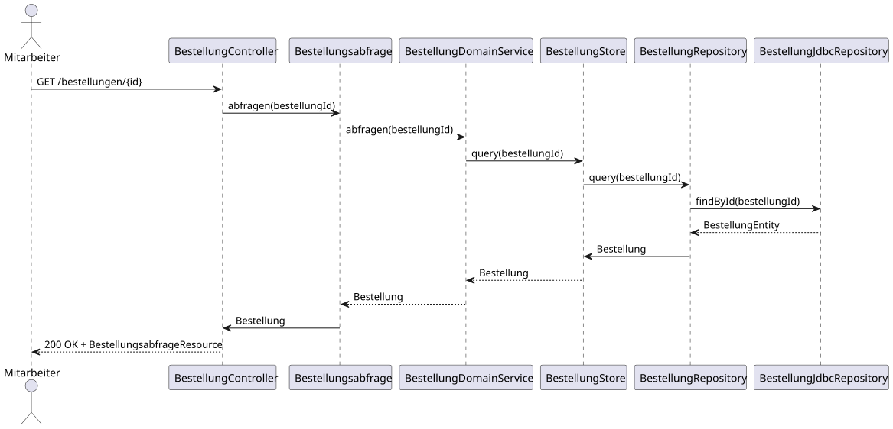

## Verteilungssicht

## Querschnittliche Konzepte

### Validierung mit Domain Primitives

Die Validierung des Domänenmodells erfolgt mithilfe der Bibliothek _domain-primitives-java_, um Validierungslogik direkt
im Konstruktor von Value Objects und Aggregates zu implementieren und somit einen konsistenten Datenbestand zu
gewährleisten.

**Value Object Validierung**

Value Objects validieren ihre Werte anhand definierter Invarianten:

```java
// ValueObjectId: Muss gültige UUID sein
public class ValueObjectId extends ValueObject<String> {
    public ValueObjectId(String value) {
        super(value, isUUID());
    }
}
```

**Aggregate-Validierung**

Aggregates validieren die Vollständigkeit der aggregierten Value Objects und Entitäten:

```java
// Entity-Validierung auf höchster Ebene
@Override
protected void validate() {
    validateNotNull(referenz1, "Referenz 1");
    validateNotNull(valueObject2, "Value Object 2");
    evaluateValidations();
}
```

### Mapping-Strategie

Zur Trennung der Ringe und zur Einhaltung des Prinzips der Entkopplung verwendet das System MapStruct zur
typensicheren und automatisierten Abbildung zwischen:

DTOs der Ein-/Ausgabeschicht (z. B. REST oder DB) und den Domänenobjekten im Kern

Für jede Richtung und jeden Adaptertyp werden separate DTOs definiert. Die Mappings erfolgen über dedizierte
Mapper-Interfaces.

### Besondere ID-Behandlung:

Beim Persistieren von neuen Entitäten ohne initiale ID kann das ID-Handling nach zwei Varianten gelöst werden:

**Variante 1:** Konstruktorbasierte ID-Initialisierung

- Zwei Konstruktoren: mit und ohne ID
- Der Mapper entscheidet zur Laufzeit anhand der ID-Präsenz, welcher Konstruktor verwendet wird (@ObjectFactory)

**Variante 2:** Setter-basierte ID-Zuweisung

- Es existiert ein Konstruktor ohne ID
- Die ID wird nach der Initialisierung per Setter gesetzt
- Die Zuweisung erfolgt im Mapper implizit durch MapStruct

### Exception Handling

Die Fehlerbehandlung auf REST-Ebene erfolgt über einen @ControllerAdvice[r] pro Fachmodul. Exceptions aus der Domäne
werden dabei in standardisierte HTTP-Antworten überführt:

- InvariantException → 400 Bad Request
- EntityNotFoundException → 404 Not Found
- PersistenceException → 500 Internal Server Error

Jeder Fehlerfall wird in ein strukturiertes Fehlerobjekt umgewandelt, das Name, Nachricht und ggf. Fehlerursache
enthält.

## Architekturentscheidungen

## Qualitätsanforderungen

### Qualitätsbaum

### Qualitätsszenarien

## Risiken und technische Schulden

## Glossar

| Begriff        | Definition        |
|----------------|-------------------|
| *\<Begriff-1>* | *\<Definition-1>* |


